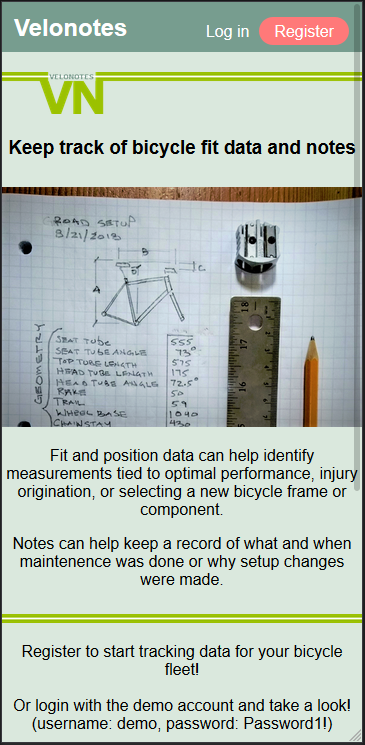
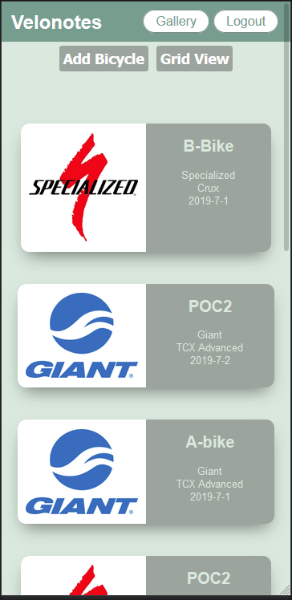
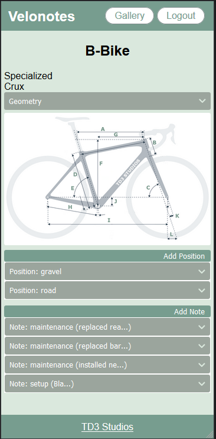
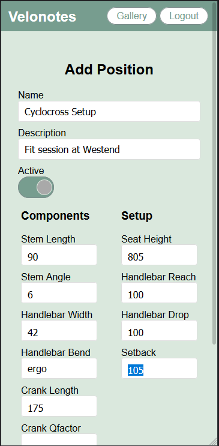

Velonotes

http://velonotes.com

What is velonotes?

Snacks are a quintessential part of cycling culture. Grabbing a pre-ride coffee, mid-ride scone, or post-ride tacos and beer can often be just as important as the ride itself. 

Snack finder's goal is to help locate quality snacks to fill this essential need. This is done by leveraging Google's APIs along with specific keywords to target independent style establishments with artisan coffee, micro brews, or street tacos.

Key Technologies:

ReactJS
NodeJS
CSS